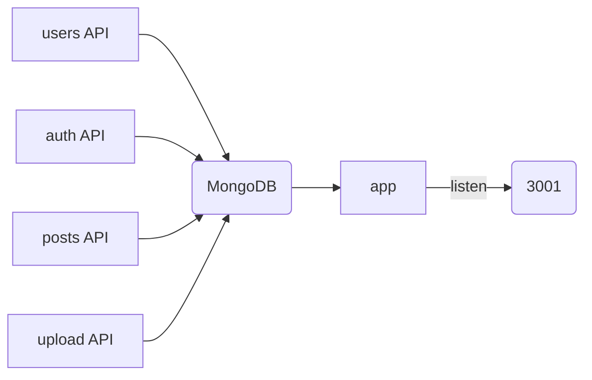

# サーバーサイド

## 概要
このサーバーサイドは、Expressを用いたRESTful APIの実装です。MongoDBデータベースと接続され、users, auth, postsといった各種APIが提供されています。

## 使用技術
- Node.js（バージョン14.17.5）
- Express
- MongoDB / Mongoose
- dotenv

## ディレクトリ構成
```
└──backend
    ├──models
    │   ├──Post.js
    │   └──User.js
    ├──package-lock.json
    ├──package.json
    ├──public
    │   └──images
    │       ├──1666584162392map_white.png
    │       ├──1666670097503IMG_8279.jpg
    │       ├──166667123615116882575623338.jpg
    │       ├──166667126205316882575623338.jpg
    │       ├──16882575623338.jpg
    │       ├──event.jpeg
    │       ├──heart.png
    │       ├──map_white.png
    │       ├──person
    │       │   ├──1.jpeg
    │       │   ├──2.jpeg
    │       │   ├──3.jpeg
    │       │   ├──4.jpeg
    │       │   ├──5.jpeg
    │       │   └──noAvatar.png
    │       ├──post
    │       │   ├──1.jpeg
    │       │   ├──2.jpeg
    │       │   ├──3.jpeg
    │       │   ├──4.jpeg
    │       │   └──5.jpeg
    │       ├──promotion
    │       │   ├──promotion1.jpeg
    │       │   ├──promotion2.jpeg
    │       │   └──promotion3.jpeg
    │       └──star.png
    ├──routes
    │   ├──auth.js
    │   ├──posts.js
    │   ├──upload.js
    │   └──users.js
    └──server.js
```

## ファイル概要
- models: MongoDBのスキーマを定義（Post.js, User.js）している。
- public: 静的ファイル（画像）を保存している。
- routes: 各種APIの処理を記述している。
- server.js: サーバーを起動するファイル。Expressのミドルウェアやルートの設定を行っている。

## 実行方法
1. `.env` ファイルをルートディレクトリに作成し、以下のような内容を記述してください。
```
MONGOURL=<MongoDB接続用URL>
```
2. `npm install` を実行し、必要なパッケージをインストールしてください。
3. `npm run dev` コマンドを実行し、サーバーを起動してください。


## MERMAIDによる処理の概要


上記の処理は、各APIがMongoDBにアクセスし、それをExpressアプリケーションで受け取る処理を表しています。Expressアプリケーションは、PORT `3001` で受け取ったリクエストを各APIに振り分けることで、アプリケーション全体の処理を制御しています。また、staticファイルの取得を、Expressが提供する `express.static()` メソッドで設定しています。